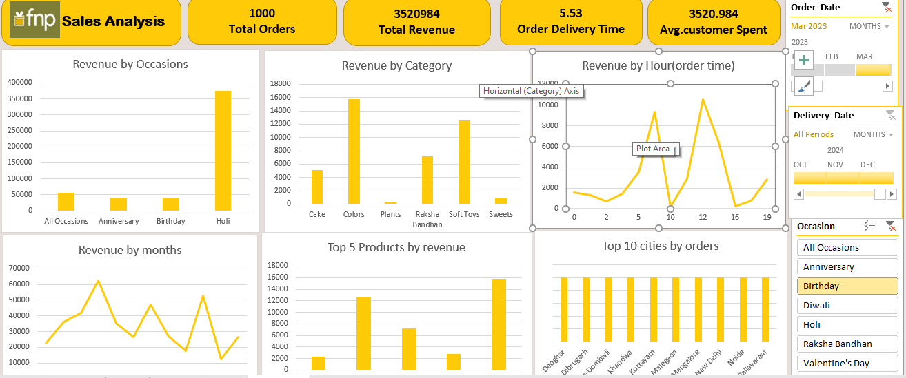

# 📊 Ferns and Petals Sales Analysis Dashboard (Excel)

## 📌 Problem Statement

Ferns and Petals (FNP) is an online gifting platform that delivers gifts for various occasions such as Diwali, Raksha Bandhan, Holi, Valentine's Day, Birthdays, and Anniversaries.

The company wants to analyze its sales data to understand customer purchasing behavior, product performance, and delivery efficiency.

Using the provided dataset containing order details, customer information, products, and delivery dates, the goal of this project is to build an interactive dashboard that helps identify key business insights and support data-driven decision making.

---

## 🎯 Business Questions

The dashboard answers the following key business questions:

1. **Total Revenue** – What is the overall revenue generated?
2. **Average Order and Delivery Time** – How long does it take for orders to be delivered?
3. **Monthly Sales Performance** – How do sales fluctuate across months in 2023?
4. **Top Products by Revenue** – Which products generate the highest revenue?
5. **Customer Spending Analysis** – What is the average amount spent by customers?
6. **Sales Performance of Top 5 Products** – How are the top 5 products performing?
7. **Top 10 Cities by Number of Orders** – Which cities place the most orders?
8. **Order Quantity vs Delivery Time** – Does order quantity affect delivery time?
9. **Revenue Comparison by Occasion** – Which occasions generate the most revenue?
10. **Product Popularity by Occasion** – Which products are most popular during specific occasions?

---

## 🛠 Tools Used

* Microsoft Excel
* Power Query (ETL Process)
* Power Pivot (Data Modeling & Measures)
* Pivot Tables and Pivot Charts
* Slicers and Timeline Filters

---

## 🔄 ETL Process (Power Query)

Data was cleaned and transformed using Power Query:

* Removed duplicate records
* Handled missing values
* Standardized date formats
* Transformed columns
* Prepared the dataset for analysis

---

## 🔗 Data Modeling (Power Pivot)

A data model was created using Power Pivot:

* Relationships created between tables
* Calculated columns and measures created
* Optimized data structure for dashboard analysis

---

## 📈 Key Metrics

The dashboard tracks the following KPIs:

* Total Orders
* Total Revenue
* Average Customer Spend
* Order Delivery Time

---

## 📊 Dashboard Insights

The dashboard provides insights such as:

* Revenue by Occasion
* Revenue by Product Category
* Revenue by Hour
* Monthly Revenue Trend
* Top 5 Products by Revenue
* Top 10 Cities by Orders

---

## ✨ Features

* Interactive slicers for filtering data
* Timeline filter for date analysis
* Dynamic KPI cards
* Pivot charts for visual insights
* Clean and interactive dashboard layout

---

## 💼 Business Value

This dashboard helps the business:

* Identify high-performing products
* Understand customer purchasing patterns
* Track sales trends across months
* Analyze delivery performance
* Improve decision-making using data insights

---

## 🖼 Dashboard Preview

---

## 🚀 Skills Demonstrated

* Data Cleaning
* Data Transformation
* Data Modeling
* Dashboard Development

## 💼 Project Live

https://1drv.ms/x/c/2f08a320ef5a7be0/IQBIpC8kW0F-QpHXjsUdftI5AYNkhtVBJXEukDGP62eEt50

  
Live link of Project:
